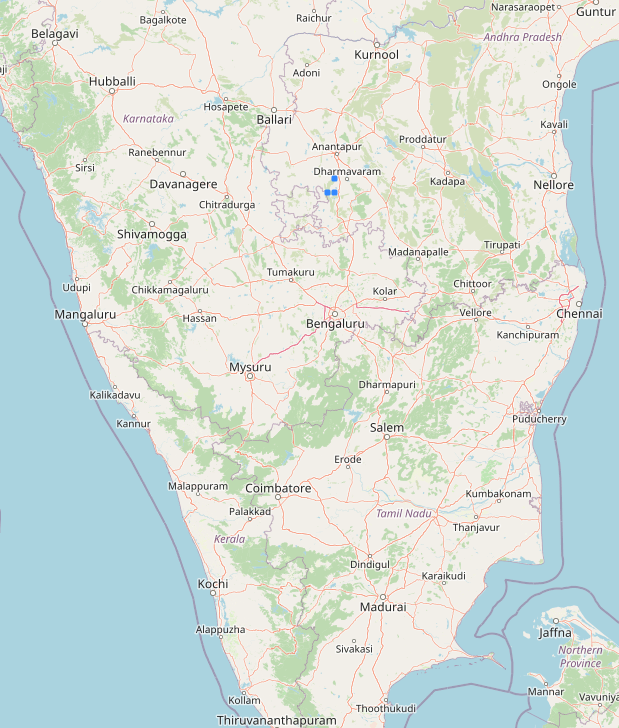

# **SUBSURFACE AI: Unveiling New Mineral Frontiers through Deep Learning**

This repository was created as part of the **IndiaAI Hackathon on Mineral Targeting 2025**, in collaboration with the **Geological Survey of India (GSI)**. The goal is to identify concealed and deep-seated mineralized zones across a 39,000 sq. km area in Karnataka and Andhra Pradesh using deep learning techniques applied to integrated geoscientific data.

## **1. Data Sources**

The datasets used in this project were compiled from multiple geoscientific domains:

* **Geological Maps** (1:25,000 and 1:50,000 scale): Faults, folds, dykes, lithology, lineaments
* **Geochemical Data**: Elemental concentrations of REE, Ni-PGE, Cu, Au, etc.
* **Geophysical Data**: Elevation, gravity, Bouguer anomalies, density, magnetic susceptibility
* **Mineral Occurrence Records**: Historical data used for label assignment
* All datasets were reprojected to EPSG:32643 and standardized on **4 km × 4 km grid** cells.

## **2. Project Approach (Summary)**

* Created uniform spatial grids for the region and overlaid geoscientific datasets.
* Assigned binary labels to each grid cell: `1` for mineralized, `0` for non-mineralized.
* Handled missing values, concatenated structural data from different scales, and reshaped data for model input.
* Trained and validated a deep learning model using this gridded, structured dataset.

## **3. Algorithm Used**

* **Optimized Long Short-Term Memory (LSTM)** Neural Network

  * Architecture: LSTM → Dropout → Dense (ReLU) → Dropout → Dense (Sigmoid)
  * Loss: Binary Crossentropy | Optimizer: Adam
  * Accuracy: **91%** on test data
  * Evaluation: Confusion Matrix, Classification Report (Precision, Recall, F1-Score)

## **4. Outputs and Visualizations**

* **Predicted Mineral Zones** across 3 different grid resolutions:

  * 5 km Grid → 1 zone
  * **4 km Grid → 3 zones (Optimal)**
  * 3 km Grid → 1 zone
* Visualized predicted mineral zones on geospatial maps
* Sample output chart:

  
  

  

## **5. Conclusion**

This project successfully demonstrates the power of deep learning, particularly LSTM, in **data-driven mineral prospectivity mapping**. The **4 km × 4 km grid resolution** offered the best balance between spatial accuracy and model performance.
Three promising mineral zones were predicted and finalized for **further geological validation**, laying the foundation for advanced AI-assisted mineral exploration in India.

